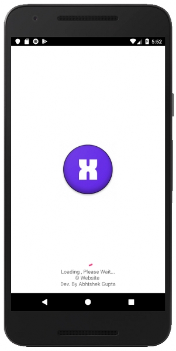
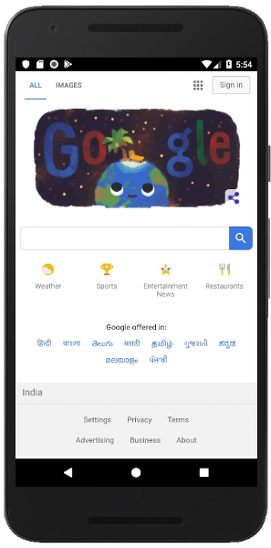

# Template for Android App for a Website
 


## To Run App
1. Download ```APP-APK.apk``` [Download Link](https://raw.githubusercontent.com/ft-abhishekgupta/android-website-app-template/master/APP-APK.apk "Direct Download")
1. Install on Android Device and run.

## To use source code : 
1. Clone Repository <br>
```git clone https://github.com/ft-abhishekgupta/android-website-app-template```
1. Open Repository in Android Studio
1. Sync Project and Install Required Dependencies
1. Build and Run Project.

## Modify App for your own website 
1. Modify values in ```strings.xml``` file with your own website name and url.
1. Generate Icons at https://romannurik.github.io/AndroidAssetStudio/icons-launcher.html and paster them in **res** folder
1. Also replace logo.png in **res/drawable** folder 
1. Build and run. ```Your App is Ready```

## Screenshots


